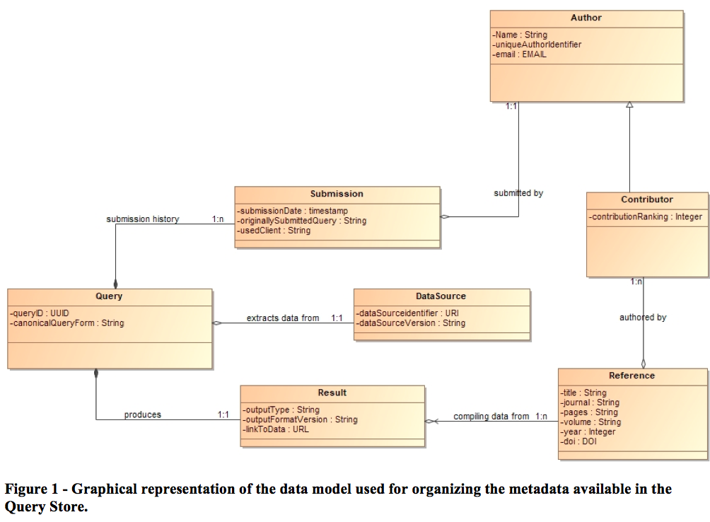

The Query Store – a key element of the RDA recommendation.
==========================================================
The Research data Alliance (https://www.rd-alliance.org) and its Data Citation Working group 
(https://www.rd-alliance.org/groups/data-citation-wg.html) provided the researcher and data centres 
communities with a recommendation to identify and cite dynamic data. The proposed solution relies on 
a query centric view of data-sets and the set up of a Query Store: data are stored in a versioned and 
time-stamped manner and accessed through queries. A Query Store will store all the identified and time stamped queries, 
together with relevant query metadata and availability to recover the data as it existed at the time when a given query 
was executed. In the RDA-recommendation context and in what follows the term “query” has to be understood in its wider sense: 
it stands for any processing mechanism for extracting data from a computer-based system.

Main issues in implementing the Recommendation to the VAMDC case.
==================================================================
From the technical point of view, VAMDC is a distributed e-infrastructure for sharing atomic and molecular data. The “V” of VAMDC 
stands for Virtual, in the sense that the e-infrastructure does not contain data: it is a wrapping for exposing in a unified way 
a set of heterogeneous databases. An ad hoc wrapping software, called Node-Software, exists for transforming an autonomous 
database into a VADMC federated database, called data-Node. Each data-Node accepts queries submitted in a standard 
grammar (subset of SQL) and provides output formatted into a standard XML file (XSAMS file, designed for atomic & molecular processes). 
All the data-Nodes are listed into registries (a kind of yellow pages services for discovering available resources). A user 
wishing to extract data from VAMDC:
  * May use client software: while receiving a query, the client asks the registries what are the available data-Nodes, and then dispatches the query to all these node. Each node produces a standardized output file. The client software collects all the produced results and finally serves to the user the result.
  * May submit his/her queries directly to the specific node he/she wants to hit.
Indeed, VAMDC is a distributed architecture with no central management system. 

The RDA-Data Citation recommendation comes for 
standalone data-repositories and/or warehouses. How to implement the recommendation in the VAMDC distributed infrastructure? 
The solution belongs to a space with lot of constraints:
 * Any evolution will impact each of the (today ~30) federated databases.
 * The majority of the Consortium members must validate any technological change of the infrastructure.
The solution must cause minimal effects on the existing infrastructure and have minimal implementing cost for the database owners. 
This constraint suggests embedding the solution into the wrapping software layer (Node-Software, https://github.com/VAMDC/NodeSoftware) 
transforming an autonomous Database into a data-Node.
The implementation of the RDA recommendation we produced is an overlay to the existing VAMDC node-software layer, thus independent 
from any specific database.
 * Concerning the data versioning and time-stamping, we have two different mechanisms:
	  -	A fine-grained mechanism: based on an evolution of the XSAMS standard for tracking data modifications (Technical details 
    of the XSAMS evolution are described in http://dx.doi.org/10.1016/j.jms.2016.04.009. A free arxiv version is available at 
    https://arxiv.org/abs/1606.00405. The proposed evolution will be part of the 2018 VAMDC realease)
	  -	A coarse-grained mechanism: at each data modification made to a given data- node, the version of the data-node changes. 
    With he second mechanisms we have a mechanism for informing that something has changed on a given data-node. In other words, we know that the result of an identical query may be different from one version to the other. The detail of which data changed is accessible using the first mechanism.
 * The Query Store is built over the coarse-grained mechanism. It is plugged over the existing VAMDC e-infrastructure and, due to the 
 distributed architecture, it may be seen as a smart asynchronous log-service.

The functioning of the VAMDC Query Store
==========================================
When a data-Node receives a query from a user,
 1. It generates a unique query Token (this can be seen as a session token associated to the incoming query)
 2.	It answers the query by producing outputs, which are returned to the user, together with the generated query token (in the response header).
 3.	It notifies (in a non blocking way) to a specific notification service of the Query Store the query-Token, the content of the query, the version of the node and the version of standards used for formatting the output.
It is worth noting that this process has no impact on the existing infrastructure whatsoever: the data extraction process is not slowed down and, if the Query Store cannot be reached, the user will receive its data.
The Query-Store stores the received information and reduces the query to a standard form (using the VAMDC SQL Comparator library, https://github.com/VAMDC/VamdcSqlRequestComparator). It checks if it exists a semantically identical query, submitted to the same node, having the same node version and working with the same version of the standards.
 1. If there is no such a query, the Query-Store provides the new query with a unique UUID and timestamp, download the data from the notifying data-node and process the output for extracting bibliographic information and metadata. All the relevant metadata are stored and associated with the generated UUID. Metadata are kept permanently.
 2. If such a query is already stored in the Query-Store, the new query time-stamp is added to the lists of the other time-stamps already associated with the query.
At any further moment, the user may exchange the query Token he received from the data-Node with the final UUID assigned by the Query Store: by sending to a specific service endpoint of the Query-Store the query token (plus further information, e.g. the user e-mail and/or ORCID, information about the used client, etc...) the user will receive the unique query identifier associated with his/her query.

The meta-data and data conveyed by the VAMDC Query Store
The unique identifier assigned to each query is resolvable (and is both human and machine actionable). The lending page conveys to the user all the metadata associated with the query, and provides access to the underlying data. The conveyed information, together with its structuration, is represented in the following figure

We may see that a set of personal information is stored into the Query Store (essentially, all the queries submitted by a given user). This information is stored only for internal functioning and for providing better user experience. All the public interfaces to the Query Store information are completely de-identified by virtually cutting the link “submitted by” between the Submission class and the Author class.
 * The implementing note of the VAMDC Query Store is available at https://github.com/VAMDC/QueryStore/blob/master/documentation/ImplementingNote.pdf
 * A demonstration of the VAMDC Query Store in action is available at https://youtu.be/kDDWFpi22cU.
 * A presentation focused on the implementation of the VAMDC Query Store is available at https://youtu.be/rfHfnPvH1r4.
The implemented Query Store may be easily adapted to a wide number of cases:
 * The solution we proposed works in the case of the distributed VAMDC infrastructure and, a fortiori, also works in the case of standalone database/warehouse.
 * A data provider wishing to adopt the Query Store has just to define what is the relevant information that should be notified to the Query-Store (cf. point 3 of the first list of this paragraph), and has to define the uniqueness criterion to use in query distinction.
